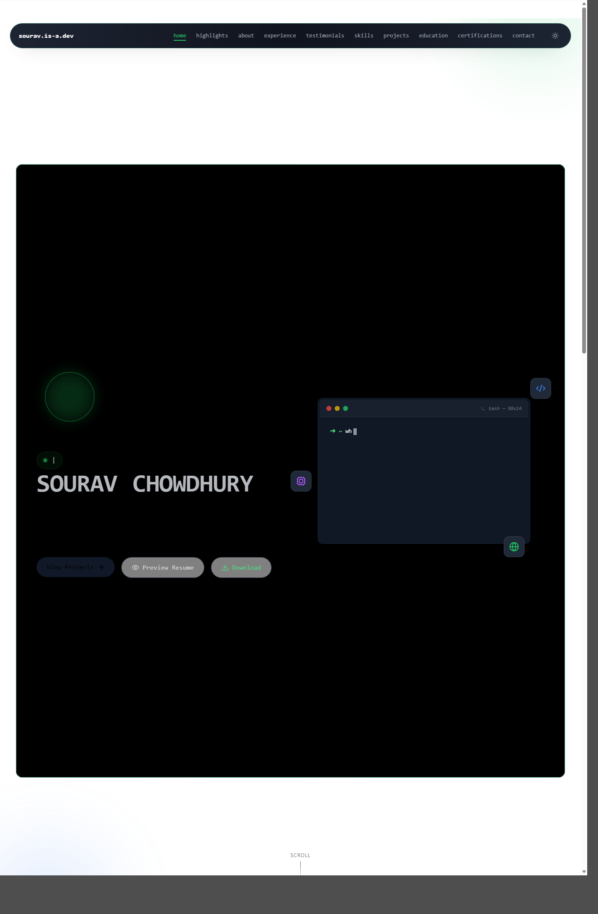
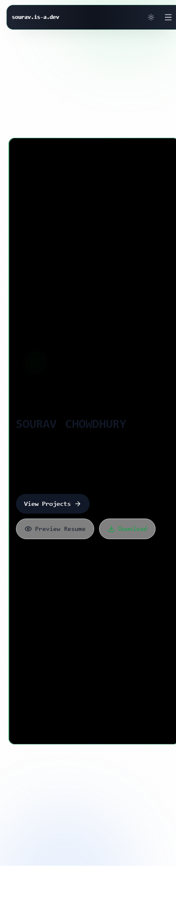

# Sourav Portfolio

A production-style frontend portfolio built with React 19, TypeScript, Tailwind CSS, Framer Motion, Zustand, and React Router. The app is designed to feel closer to a real product than a static portfolio, with recruiter-focused flows, route-level views, analytics, dynamic widgets, AI-inspired tools, and progressive enhancement features like PWA support.

## Preview




## Highlights

- Single-page landing experience with modular sections and route transitions
- Dedicated routes for case studies and a dashboard view
- Glassy product-style UI with animated borders, Framer Motion-first interactions, and theme support
- Scroll-aware floating navbar with active section tracking and spring-smoothed progress indicator
- Command palette with navigation shortcuts and quick actions via `Ctrl/Cmd + K`
- Recruiter mode, theme customizer, and dismissible open-to-work banner
- Searchable, filterable, draggable projects grid with modal previews, case-study navigation, and isolated 3D hover flips
- Skill cards with staggered entry, glow states, icon motion, and single-card hover rotation
- Hero section with floating visual elements, magnetic CTAs, and reduced-motion-aware motion behavior
- Dashboard analytics powered by persisted interaction events in Zustand
- Developer signals section with GitHub, LeetCode, and article data plus cache-backed fallbacks
- AI Lab with project recommendations and resume analysis
- Resume preview and animated download flow
- PWA manifest, service worker, and install prompt support
- Error boundaries, route/section lazy loading, and test coverage for utility logic

## Stack

- React 19
- TypeScript
- React Router DOM 7
- Tailwind CSS 3
- Framer Motion
- Zustand
- Lucide React
- `pdfjs-dist`
- `mammoth`
- Vite via `rolldown-vite`
- Vitest + Testing Library

## Motion System

- All primary UI animations use Framer Motion.
- Section entry animations are centralized through [`src/lib/motion.ts`](/c:/portfolio2/sourav-portfolio/src/lib/motion.ts) for consistent reveal timing and `viewport={{ once: true }}` behavior.
- Shared animated surfaces like [`src/components/common/AnimatedBorder.tsx`](/c:/portfolio2/sourav-portfolio/src/components/common/AnimatedBorder.tsx), [`src/components/common/MagneticButton.tsx`](/c:/portfolio2/sourav-portfolio/src/components/common/MagneticButton.tsx), and the navbar progress bar are driven by Framer Motion.
- Reduced motion is respected with `useReducedMotion()` so heavy transforms and looping motion degrade cleanly when the user prefers less animation.

## Routes

- `/` renders the main portfolio experience
- `/dashboard` renders the analytics dashboard
- `/case-studies/:slug` renders a structured case-study page
- Unknown routes redirect to `/`

## Homepage Sections

The homepage is composed in [`src/App.tsx`](/c:/portfolio2/sourav-portfolio/src/App.tsx).

1. `Hero`
2. `RecruiterHighlights`
3. `About`
4. `Experience`
5. `Testimonials`
6. `Skills`
7. `Projects`
8. `DeveloperSignals`
9. `AIWorkbench`
10. `Education`
11. `Certifications`
12. `Contact`

Most sections are lazy-loaded and mounted near the viewport to reduce initial work on first visit.

## Key Product Features

### Navigation and shell

- [`src/components/layout/Navbar.tsx`](/c:/portfolio2/sourav-portfolio/src/components/layout/Navbar.tsx) handles floating navigation, active section highlighting, recruiter mode, theme toggle, dashboard navigation, and spring-based scroll progress.
- [`src/components/common/CommandPalette.tsx`](/c:/portfolio2/sourav-portfolio/src/components/common/CommandPalette.tsx) provides fuzzy command search, keyboard navigation, route shortcuts, and quick actions.
- [`src/components/common/PwaInstallPrompt.tsx`](/c:/portfolio2/sourav-portfolio/src/components/common/PwaInstallPrompt.tsx) exposes installable-app UX when supported.

### Motion-rich sections

- [`src/components/sections/Hero.tsx`](/c:/portfolio2/sourav-portfolio/src/components/sections/Hero.tsx) includes floating profile visuals, magnetic CTA buttons, animated status indicators, and terminal-style interaction.
- [`src/components/sections/Skills.tsx`](/c:/portfolio2/sourav-portfolio/src/components/sections/Skills.tsx) renders staggered skill groups, glow-on-hover cards, optional audio feedback, and isolated 3D hover rotation so only one skill card rotates at a time.
- [`src/components/sections/Projects.tsx`](/c:/portfolio2/sourav-portfolio/src/components/sections/Projects.tsx) uses isolated hover state per card so only one project card performs the 3D `rotateY` flip at a time.

### Projects and case studies

- [`src/components/sections/Projects.tsx`](/c:/portfolio2/sourav-portfolio/src/components/sections/Projects.tsx) includes category filters, fuzzy search, recruiter-aware ordering, drag-and-drop reordering, modal previews, live demo embeds, and per-card motion interactions.
- [`src/hooks/useProjectDiscovery.ts`](/c:/portfolio2/sourav-portfolio/src/hooks/useProjectDiscovery.ts) centralizes project filtering, prioritization, and recommendation inputs.
- [`src/data/projects.ts`](/c:/portfolio2/sourav-portfolio/src/data/projects.ts) contains structured project metadata, images, impact notes, and case-study links.
- [`src/data/caseStudies.ts`](/c:/portfolio2/sourav-portfolio/src/data/caseStudies.ts) powers the dedicated case-study routes.

### Analytics and app state

- [`src/store/useAppStore.ts`](/c:/portfolio2/sourav-portfolio/src/store/useAppStore.ts) stores recruiter mode, accent theme, analytics events, and project order with persisted Zustand state.
- [`src/pages/DashboardView.tsx`](/c:/portfolio2/sourav-portfolio/src/pages/DashboardView.tsx) visualizes page views, clicks, project interactions, and time-range filtering.

### Developer data and AI Lab

- [`src/components/sections/DeveloperSignals.tsx`](/c:/portfolio2/sourav-portfolio/src/components/sections/DeveloperSignals.tsx) fetches GitHub, LeetCode, and article data with graceful fallback behavior.
- [`src/services/developerData.ts`](/c:/portfolio2/sourav-portfolio/src/services/developerData.ts) manages external data retrieval and caching.
- [`src/components/sections/AIWorkbench.tsx`](/c:/portfolio2/sourav-portfolio/src/components/sections/AIWorkbench.tsx) combines project recommendations with resume analysis.
- [`src/lib/extractResumeText.ts`](/c:/portfolio2/sourav-portfolio/src/lib/extractResumeText.ts) supports `PDF`, `DOCX`, and text-based resume uploads.
- [`src/lib/resumeAnalyzer.ts`](/c:/portfolio2/sourav-portfolio/src/lib/resumeAnalyzer.ts) scores resume content and highlights missing keywords by role.

### Reliability and performance

- [`src/components/system/ErrorBoundary.tsx`](/c:/portfolio2/sourav-portfolio/src/components/system/ErrorBoundary.tsx) provides app-level crash recovery.
- [`src/components/system/SectionErrorBoundary.tsx`](/c:/portfolio2/sourav-portfolio/src/components/system/SectionErrorBoundary.tsx) isolates failures per homepage section.
- [`src/main.tsx`](/c:/portfolio2/sourav-portfolio/src/main.tsx) lazy-loads routes and manages service worker behavior for dev and production.
- [`src/App.tsx`](/c:/portfolio2/sourav-portfolio/src/App.tsx) defers below-the-fold section rendering with viewport-aware loading.
- Shared loading placeholders and animated decorative layers are motion-driven rather than CSS-keyframe driven in the main app surfaces that were recently updated.

## Project Structure

```text
sourav-portfolio/
  public/
    images/              project assets and resume PDF
    manifest.webmanifest PWA manifest
    sw.js                service worker
  src/
    components/
      common/            reusable UI, modal, motion, and shell utilities
      layout/            navbar, footer, and banner components
      sections/          homepage sections
      system/            error boundaries
    constants/           shared UI maps and configuration
    data/                project and case-study content
    hooks/               reusable discovery logic
    lib/                 analyzers, search, extraction, and cache helpers
    pages/               route-level pages
    services/            external data integrations
    store/               Zustand stores
    App.tsx              homepage composition
    main.tsx             application entry and routing
  index.html             metadata and root document
  vite.config.ts         Vite configuration
  tailwind.config.js     Tailwind configuration
```

## Local Development

### Prerequisites

- Node.js 18 or newer
- npm

### Install

```bash
npm install
```

### Start the dev server

```bash
npm run dev
```

### Build for production

```bash
npm run build
```

### Preview the production build

```bash
npm run preview
```

### Run tests

```bash
npm run test
```

## Available Scripts

- `npm run dev` starts the Vite dev server
- `npm run build` creates the production bundle in `dist/`
- `npm run preview` serves the built app locally
- `npm run test` runs the Vitest suite
- `npm run test:watch` runs Vitest in watch mode

## Current Case Studies

These slugs currently have dedicated route content:

- `resumeiq`
- `foodooza`
- `pollroom`
- `estateperks`

## Notes

- The active application lives in this `sourav-portfolio/` folder.
- The workspace root duplicate `package.json` setup was removed; this folder is now the single source of truth for app dependencies.
- Some live-data widgets use fallback/mock data when upstream data is unavailable.
- Recent interaction updates focused on keeping hover rotations isolated per card in both the Projects and Skills sections.
