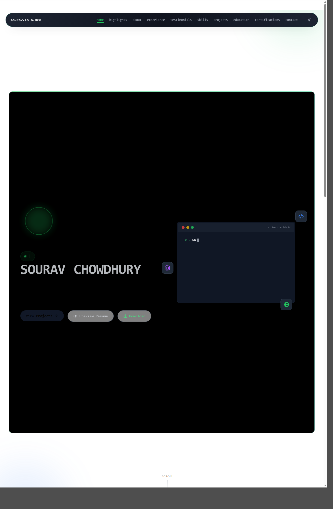
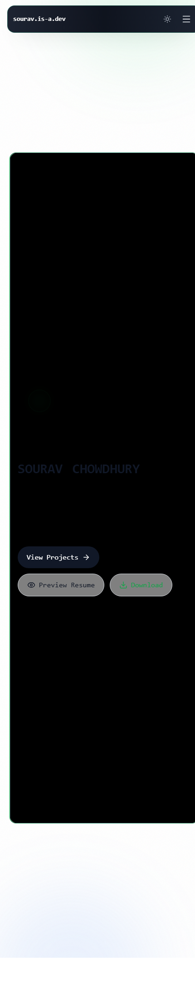

# Sourav Portfolio

A React 19 + TypeScript portfolio built as a product-style frontend experience rather than a static resume page. It combines animated sections, recruiter-focused project browsing, route-based case studies, dashboard analytics, and PWA support in a single Vite app.

**Live:** [sourav.is-a.dev](https://sourav.is-a.dev)

## Preview




## What This App Includes

- Single-page portfolio with lazy-mounted sections for faster first load
- Dedicated routes for `/dashboard` and `/case-studies/:slug`
- Theme-aware UI with Framer Motion transitions and reduced-motion support
- Lenis smooth scrolling, with a native-scroll fallback for reduced motion
- Command palette (Ctrl/Cmd + K), recruiter mode, and interaction analytics
- Searchable and reorderable projects with modal previews
- Canvas cursor effects, including a click burst that cycles through rainbow colours
- Draggable WhatsApp contact widget and a back-to-top action
- PWA manifest, service worker, and install prompt support
- Section-level and app-level error boundaries
- Build-time sitemap generation plus structured data for search

## Stack

- React 19
- TypeScript
- React Router DOM 7
- Tailwind CSS 3
- Framer Motion
- Zustand
- Lenis
- Lucide React
- Vite via `rolldown-vite`
- Vitest + Testing Library

## Routes

- `/` main portfolio
- `/dashboard` analytics dashboard (excluded from search indexing)
- `/case-studies/:slug` case study detail page
- unknown routes redirect to `/`

## Homepage Sections

The homepage is composed in [`src/App.tsx`](./src/App.tsx).

1. `Hero`
2. `About`
3. `Experience`
4. `Skills`
5. `Projects`
6. `GitHubActivity`
7. `Education`
8. `Certifications`
9. `Contact`

## Key Files

- [`src/App.tsx`](./src/App.tsx) handles homepage composition and viewport-aware section mounting.
- [`src/main.tsx`](./src/main.tsx) sets up routing, route transitions, and service worker behavior.
- [`src/components/layout/Navbar.tsx`](./src/components/layout/Navbar.tsx) manages navigation, theme toggling, scroll progress, and dashboard access.
- [`src/components/layout/Footer.tsx`](./src/components/layout/Footer.tsx) holds the sitemap, contact details, and resume/dashboard links.
- [`src/components/common/CommandPalette.tsx`](./src/components/common/CommandPalette.tsx) provides keyboard-driven navigation and quick actions.
- [`src/components/common/CursorSpiderEffect.tsx`](./src/components/common/CursorSpiderEffect.tsx) draws the cursor trail and the per-click colour-cycling web burst.
- [`src/components/sections/Projects.tsx`](./src/components/sections/Projects.tsx) contains filtering, fuzzy search, modal previews, and drag-based project ordering.
- [`src/hooks/useProjectDiscovery.ts`](./src/hooks/useProjectDiscovery.ts) centralizes project filtering and recommendation logic.
- [`src/hooks/usePageMetadata.ts`](./src/hooks/usePageMetadata.ts) applies per-route title, description, and canonical URL.
- [`src/providers/SmoothScrollProvider.tsx`](./src/providers/SmoothScrollProvider.tsx) wraps Lenis and exposes `scrollTo`.
- [`src/store/useAppStore.ts`](./src/store/useAppStore.ts) stores recruiter mode, analytics events, and project ordering.
- [`scripts/sitemap.ts`](./scripts/sitemap.ts) is a Vite plugin that emits `sitemap.xml` at build time.
- [`scripts/optimize-project-images.js`](./scripts/optimize-project-images.js) regenerates project covers from the sources in `assets/projects/`.

## Project Structure

```text
portfolio/
  assets/
    brand/                 logo source art, kept out of the shipped bundle
  public/
    images/                project assets, certificates, and resume PDF
    manifest.webmanifest   PWA manifest
    robots.txt             crawl rules, points at the sitemap
    sw.js                  service worker
    favicon.ico, icon-*    generated app icons
  scripts/
    sitemap.ts             build-time sitemap generation
  src/
    assets/                imported build-time assets
    components/
      common/              reusable UI, motion helpers, and modals
      layout/              navbar, footer, and banner components
      sections/            homepage sections
      system/              error boundaries
    constants/             shared UI maps and configuration
    data/                  project and case-study content
    hooks/                 reusable hooks
    lib/                   search, recommendations, and motion helpers
    pages/                 route-level pages
    providers/             smooth scroll provider
    store/                 Zustand stores
    App.tsx                homepage composition
    main.tsx               app entry and routing
  index.html
  tailwind.config.js
  vercel.json
  vite.config.ts
```

## Local Development

### Prerequisites

- Node.js 18+
- npm

### Install

```bash
npm install
```

### Start

```bash
npm run dev
```

### Build

```bash
npm run build
```

### Preview

```bash
npm run preview
```

### Test

```bash
npm run test
```

## Available Scripts

- `npm run dev` start the Vite dev server
- `npm run build` create a production build
- `npm run preview` preview the production build locally
- `npm run test` run the Vitest suite
- `npm run test:watch` run Vitest in watch mode

## SEO

- `sitemap.xml` is generated during `npm run build` from the case-study data in
  [`src/data/caseStudies.ts`](./src/data/caseStudies.ts), so it cannot drift out
  of sync when a case study is added.
- [`public/robots.txt`](./public/robots.txt) points at the sitemap and disallows
  `/dashboard`.
- [`index.html`](./index.html) carries the canonical URL and Person / WebSite /
  ProfilePage JSON-LD.
- [`vercel.json`](./vercel.json) 301-redirects the Vercel deployment host to the
  canonical domain so ranking signals are not split across duplicates.
- Client-rendered routes set their own metadata via `usePageMetadata`.

## Brand Assets

Icons are generated from `assets/brand/logo-source.png`. See
[`assets/brand/README.md`](./assets/brand/README.md) for the crop geometry, why
two files stay opaque, and how to regenerate them.

## Content Notes

Professional work at Oneisok Digital Solution (Voteniti and the oneisok.co
rebuild) is listed in `src/data/projects.ts` and `Experience.tsx` but has no
case-study route, since the source is not public.

Two type fields are optional so closed-source work renders honestly rather than
linking somewhere dead:

- `ProjectRecord.github` - omitted for Voteniti and Oneisok, whose cards show
  only "Open Live Demo". The GitHub action is skipped when there is no repo.
- `ExperienceEntry.credential` - the current role has no completion
  certificate, so its card renders a single "View Details" action.

`liveUrl` points at each product's canonical host: `voteniti.in` serves 200
directly, while `oneisok.co` 307-redirects to `www.oneisok.co`, so the `www`
form is linked to save visitors a redirect.

### Project cover images

Covers are optimized derivatives, not the originals. Full-resolution sources
live in [`assets/projects/`](./assets/projects/) (out of the bundle); the site
serves 1200x675 WebP with a JPEG twin from `public/images/`. This turns roughly
3.4 MB of PNG into about 190 KB. `handleCoverError` in `Projects.tsx` falls
back WebP -> JPEG -> generic preview.

Regenerate after replacing a source:

```bash
npm install --no-save sharp
node scripts/optimize-project-images.js
```

## Case Study Slugs

- `resumeiq`
- `foodooza`
- `pollroom`
- `estateperks`

## Deployment

Deployed on Vercel. `vercel.json` handles SPA rewrites, the canonical-host
redirect, and content-type headers for `robots.txt` and `sitemap.xml`. Bump
`CACHE_NAME` in [`public/sw.js`](./public/sw.js) whenever a cached asset such as
an icon changes, or returning visitors keep the old copy.
